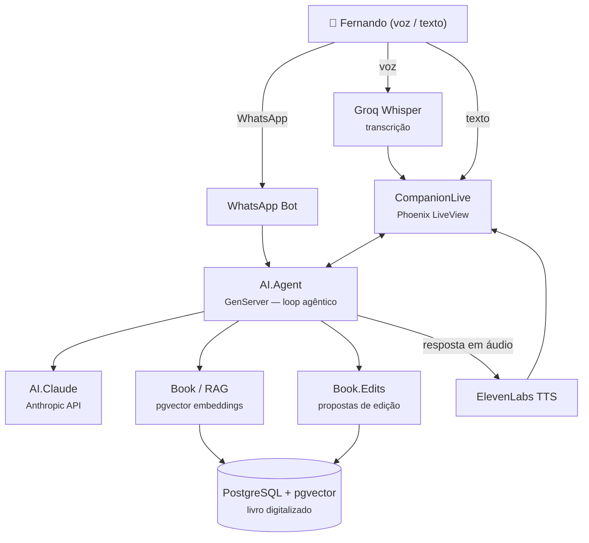

# SIPCP Companion

**Dando voz ao conhecimento de uma vida inteira.**

Em 1982, Fernando Batalha Monteiro — oficial do Exército formado pela AMAN, acadêmico da Universidade do Amazonas, especialista em administração e contabilidade — publicou o livro *"SIPCP: Sistema Integrado de Programação e Controle da Produção"*. A obra, premiada com o **Prêmio Brahma de Administração**, propunha uma visão sistêmica e cibernética da gestão da produção, inspirada em Norbert Wiener e na teoria geral de sistemas, incluindo um conceito original: a *Lei do Valor Ótimo*.

Mais de quatro décadas depois, o autor está vivo, lúcido e cheio de ideias. O mundo mudou — Indústria 4.0, IoT, inteligência artificial, digital twins — mas a visão cibernética do livro permanece surpreendentemente atual.

O **SIPCP Companion** é uma ferramenta de IA agêntica criada para que Fernando possa, com sua própria voz, **co-editar e atualizar seu livro para uma edição de 2026** — conectando a sabedoria original às tecnologias de hoje.

---

## O que é

Uma aplicação web construída com **Elixir + Phoenix LiveView** que funciona como um assistente inteligente de co-autoria:

- **Interface por voz** — O avô fala, o sistema escuta. Transcrição via Groq Whisper (otimizado para fala de idosos em português). Respostas em áudio via ElevenLabs TTS.
- **IA agêntica com OTP** — Cada sessão é um GenServer. O agente conversa, busca contexto no livro, propõe edições e aguarda aprovação. OTP *é* o framework de agentes.
- **RAG sobre o livro digitalizado** — O conteúdo completo do livro está armazenado com embeddings vetoriais (pgvector). A IA busca os trechos mais relevantes antes de responder.
- **Edição colaborativa com aprovação** — A IA nunca altera o texto sozinha. Propõe mudanças, o autor revisa e aprova ou rejeita — em português natural ("sim", "aprovado", "não", "muda").
- **WhatsApp** — Bot integrado para que o avô possa interagir pelo celular, sem precisar abrir o computador.

## Por que

Porque conhecimento não deveria morrer com quem o criou. Porque um livro premiado em 1982 merece encontrar o século XXI. E porque a tecnologia existe para servir as pessoas — especialmente aquelas que têm mais a ensinar.

## Stack

| Camada | Tecnologia |
|---|---|
| Backend | Elixir 1.17, Phoenix 1.8, LiveView |
| Banco de dados | PostgreSQL 16 + pgvector |
| IA / LLM | Claude (Anthropic) via API |
| Transcrição | Groq Whisper large-v3 |
| Síntese de voz | ElevenLabs TTS |
| Embeddings | Bumblebee (dev) / pgvector |
| Mensageria | WhatsApp Business API |
| Dev environment | Nix (flake.nix) |

## Começando

### Pré-requisitos

- [Nix](https://nixos.org/download.html) com flakes habilitado

### Setup

```bash
# Entrar no ambiente de desenvolvimento (PostgreSQL inicia automaticamente)
nix develop

# Instalar dependências e configurar banco
mix setup

# Iniciar o servidor
mix phx.server
```

Acesse [`localhost:4000`](http://localhost:4000).

### Variáveis de ambiente

| Variável | Descrição |
|---|---|
| `ANTHROPIC_API_KEY` | API key da Anthropic (Claude) |
| `GROQ_API_KEY` | API key do Groq (transcrição de áudio) |
| `ELEVENLABS_API_KEY` | API key do ElevenLabs (síntese de voz) |

## Arquitetura



## Licença

Projeto pessoal. O conteúdo do livro é propriedade intelectual de Fernando Batalha Monteiro.

---

*Feito com carinho por André Cardoso — para que a voz do avô continue ecoando.*
